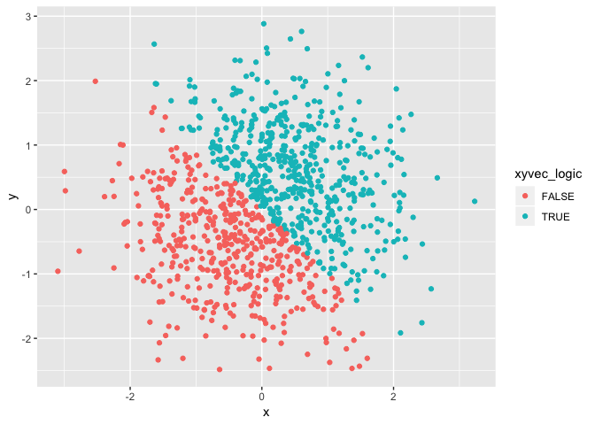
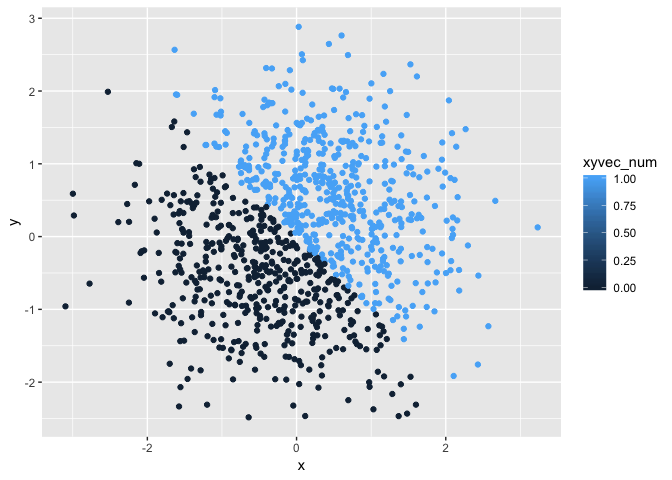

p8105\_hw1\_qg2155
================
Helen Guan
9/18/2018

Question \#1
------------

``` r
library(tidyverse)
```

    ## ── Attaching packages ───────────────────────────────────────────────────────────────────── tidyverse 1.2.1 ──

    ## ✔ ggplot2 3.0.0     ✔ purrr   0.2.5
    ## ✔ tibble  1.4.2     ✔ dplyr   0.7.6
    ## ✔ tidyr   0.8.1     ✔ stringr 1.3.1
    ## ✔ readr   1.1.1     ✔ forcats 0.3.0

    ## ── Conflicts ──────────────────────────────────────────────────────────────────────── tidyverse_conflicts() ──
    ## ✖ dplyr::filter() masks stats::filter()
    ## ✖ dplyr::lag()    masks stats::lag()

``` r
## set seed to get the same result every time for vec_random variable
set.seed(55)

## creating the dataframe
question_1 = tibble(
  vec_random = runif(10, 0, 5),
  vec_logical = vec_random > 2,
  vec_char = c("This", "is", "my", "answer", "to", "homework", "one", "question", "number", "one"),
  vec_factor = factor(c("yes", "no", "yes", "no", "yes", "no", "yes", "no", "yes", "no"))
)

## viewing the dataframe
question_1
```

    ## # A tibble: 10 x 4
    ##    vec_random vec_logical vec_char vec_factor
    ##         <dbl> <lgl>       <chr>    <fct>     
    ##  1      2.74  TRUE        This     yes       
    ##  2      1.09  FALSE       is       no        
    ##  3      0.175 FALSE       my       yes       
    ##  4      3.96  TRUE        answer   no        
    ##  5      2.80  TRUE        to       yes       
    ##  6      0.371 FALSE       homework no        
    ##  7      0.658 FALSE       one      yes       
    ##  8      1.47  FALSE       question no        
    ##  9      2.50  TRUE        number   yes       
    ## 10      0.442 FALSE       one      no

``` r
## Taking the average of each variable
mean(question_1$vec_random)
```

    ## [1] 1.620843

``` r
mean(question_1$vec_logical)
```

    ## [1] 0.4

``` r
mean(question_1$vec_char)
```

    ## Warning in mean.default(question_1$vec_char): argument is not numeric or
    ## logical: returning NA

    ## [1] NA

``` r
mean(question_1$vec_factor)
```

    ## Warning in mean.default(question_1$vec_factor): argument is not numeric or
    ## logical: returning NA

    ## [1] NA

When trying to take the average of each variable, the output for variable vec\_random is 1.620843 and vec\_logical is 0.4. The results for vec\_char and vec\_factor are both NA. The error message for the character and factor vectors are that argument is not numeric or logical.

``` r
## transforming variable types
as.numeric(question_1$vec_logical)
```

    ##  [1] 1 0 0 1 1 0 0 0 1 0

``` r
as.numeric(question_1$vec_char)
```

    ## Warning: NAs introduced by coercion

    ##  [1] NA NA NA NA NA NA NA NA NA NA

``` r
as.numeric(question_1$vec_factor)
```

    ##  [1] 2 1 2 1 2 1 2 1 2 1

The logical and factor vectors were converted to numeric vector. But the character vector received error message stating that NAs introduced by coercion. The mean of the logical vector was 0.4 and fator vector was 1.5, but the mean of character variable still produced the output of NA.

``` r
## transforming character variable to factor to numeric and factor variable to character to numeric 
as.numeric(as.factor(question_1$vec_char))
```

    ##  [1] 8 3 4 1 9 2 6 7 5 6

``` r
as.numeric(as.character(question_1$vec_factor))
```

    ## Warning: NAs introduced by coercion

    ##  [1] NA NA NA NA NA NA NA NA NA NA

I was successfully able to convert the character variable to factor to numeric, and got a mean of 5.1. However, when I converted the factor variable to character to numeric, I got the same warning message that NAs were introduced by coercion. When I tried to take the mean of the new variable, the output was NA. It appears that character variables cannot be converted directly to numeric. Character variables first need to be converted to factor and then to numeric in order for it to work.

Question \#2
------------

``` r
## set seed to ensure reproducibility
set.seed(808)

## creating the dataframe
question_2 = tibble(
  x = rnorm(1000),
  y = rnorm(1000),
  xyvec_logic = x + y > 0,
  xyvec_num = as.numeric(xyvec_logic),
  xyvec_fac = as.factor(xyvec_logic)
)

## viewing the dataframe
question_2
```

    ## # A tibble: 1,000 x 5
    ##         x       y xyvec_logic xyvec_num xyvec_fac
    ##     <dbl>   <dbl> <lgl>           <dbl> <fct>    
    ##  1  1.34   0.0199 TRUE                1 TRUE     
    ##  2 -0.350  0.104  FALSE               0 FALSE    
    ##  3  2.15   0.222  TRUE                1 TRUE     
    ##  4 -1.65  -1.12   FALSE               0 FALSE    
    ##  5 -0.584 -0.348  FALSE               0 FALSE    
    ##  6  1.18  -0.281  TRUE                1 TRUE     
    ##  7 -0.288  0.778  TRUE                1 TRUE     
    ##  8 -0.991  0.841  FALSE               0 FALSE    
    ##  9 -2.07  -0.202  FALSE               0 FALSE    
    ## 10  0.612 -0.518  TRUE                1 TRUE     
    ## # ... with 990 more rows

This dataset has 1000 rows and 5 columns. X and Y are random sample of size 1000 from a standard Normal distribution. xyvec\_logic is a logical vector that indicates whether x + y is greater than 0. xyvec\_num is a numeric and xyvec\_fac is a factor conversion of the logical vector. The mean of x is 0.0364364 and the median of x is 0.0481791. The proportion of cases for which the logical vector is true is 0.533.

Without true, it is 0.533.

``` r
## creating scatterplot of y vs x using logical vector for color points
ggplot(question_2, aes(x = x, y = y, color = xyvec_logic)) + geom_point()
```



``` r
ggsave("scatter_plot.pdf", height = 4, width = 6)

## creating scatterplots y vs x using the numeric and factor vectors for color points
ggplot(question_2, aes(x = x, y = y, color = xyvec_num)) + geom_point()
```



``` r
ggplot(question_2, aes(x = x, y = y, color = xyvec_fac)) + geom_point()
```


